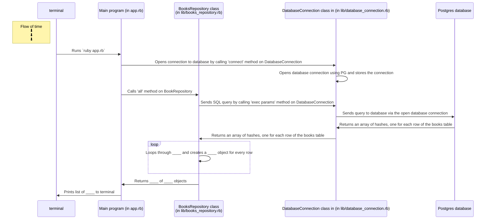

Challenge
This is a process feedback challenge. That means you should record yourself doing it and submit that recording to your coach for feedback. How do I do this?

Note: For this challenge, record yourself as you talk through your finished diagram (there is no need to record yourself as you create the diagram). As part of your submission, please upload an image file with your diagram as well as your recording.

Create a similar sequence diagram to the one above for the. Make sure your diagram includes all of the challenge you completed in the previous section. Make sure your diagram includes the following:

The terminal
The main program (app.rb)
The repository class
The database connection class
The database
You can create these diagrams in the diagramming tool of your choice but a nice one for creating sequence diagrams specifically is diagram.codes.

