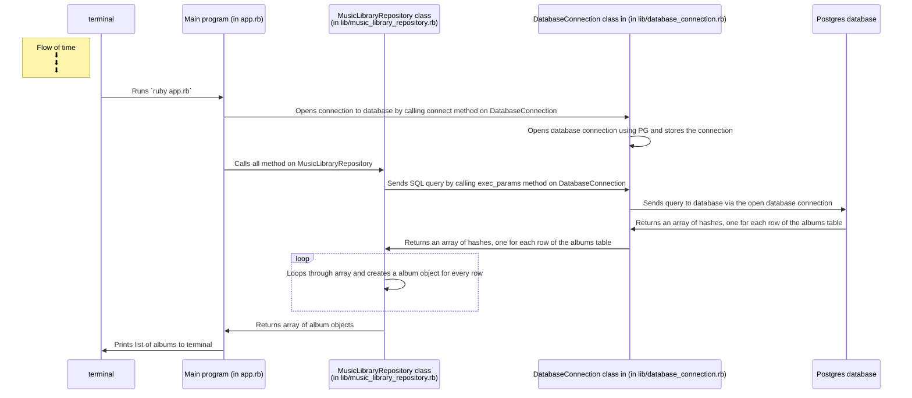
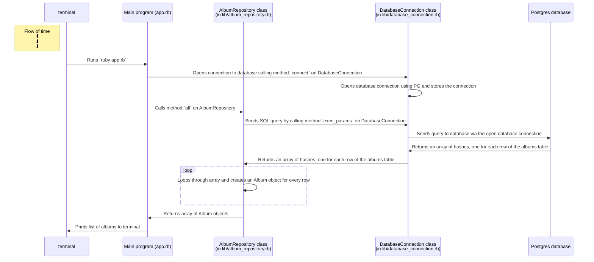

# Creating a sequence diagram for a database-backed program

In this section, you will step away from the code for a bit and learn how to build sequence diagrams to communicate what how your program is working.

Why should you bother with this? 

As you've probably noticed, the number of files in your codebase has grown considerably compared to codebases you were working with in previous exercises. In real applications, codebases can easily contain hundreds or even thousands of files. No one can hold all that information in their head at once.

 * A diagram is easier to digest, present and discuss than a whole program made of written code. It is also easier to modify if it's needed.
 * It will force you to think deeper about what is happening in your program, and to explain to yourself (and your peers) how the different components of the app is working. This will become very useful when it comes to debugging too.

**A sequence diagram** for a database-backed program helps us to explain and communicate two important things:
 * The interaction between the different components of the program and the database
 * The order in which the different parts interact together

## Exercise

The diagram presented above presents what happens in database-backed program at a high level. We can "zoom in" as needed, to illustrate more low level details. Here is a template of a more detailed sequence diagram for the program that prints out albums that you wrote in the [previous step](./02_test_driving_model_repository_classes.md#exercise).
However, some important information has been left out.

Using the codebase for that exercise, fill in the gaps in this diagram.

    
<b>Solution</b>

<!-- OMITTED -->

> If the diagram doesn't render well inside this box, click the "<->" button in top right corner to expand it.

